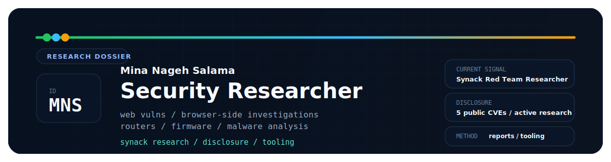
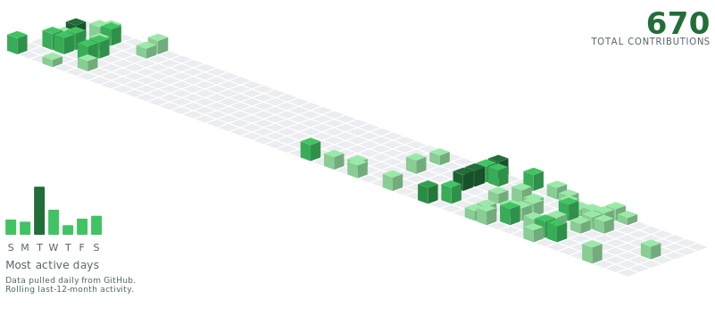

<h1 align="center">Mina Nageh Salama</h1>

  
  
  
  

  

  Security researcher and engineer focused on high-signal web vulnerability research,
  browser-side investigations, malware analysis, and practical automation that holds up under scrutiny.

  
  <!--METRICS_BADGES_START-->
  
  
<!--METRICS_BADGES_END-->
  
  

<!--SIGNAL_START-->
## Operational Snapshot

> Auto-refreshed daily via GitHub Actions. Last refresh: 2026-05-16 08:18 UTC

<table>
  <tr>
    <td width="33%">
      <strong>Current role</strong> 
      Red Team Researcher at Synack
    </td>
    <td width="33%">
      <strong>Independent research</strong> 
      Since December 2020
    </td>
    <td width="33%">
      <strong>Current study</strong> 
      MSc at University of Tuscia (UNITUS), Italy
    </td>
  </tr>
</table>

  
  
  

<strong>Status note:</strong> 5 public CVE records are listed below; 2 assigned CVE IDs are tracked separately until public reference URLs are available.

<!--SIGNAL_END-->

## Contribution Activity

  <picture>
    <source media="(prefers-color-scheme: dark)" srcset="./assets/contribs/contribs-dark.svg" />
    <source media="(prefers-color-scheme: light)" srcset="./assets/contribs/contribs-light.svg" />
    
  </picture>

## What I Work On

- Web vulnerability research with clear reproduction steps, impact framing, and remediation notes
- Browser-extension and client-side investigations tied to real exploit paths
- Router, Wi-Fi, and firmware security work with a bias toward findings that survive review
- Python and JavaScript tooling that compresses testing, validation, and reporting time
- Write-ups that stay technically dense, readable, and useful to engineers

## Selected Security Work

<!--CVE_SECTION_START-->
### Public CVEs

  &nbsp;&nbsp;&nbsp; 
  <strong><a href="https://www.cve.org/CVERecord?id=CVE-2026-34474"><code>CVE-2026-34474</code></a></strong> — ZTE ZXHN H298A / H108N 
  Credential disclosure exposing admin and WLAN access.

  &nbsp;&nbsp;&nbsp; 
  <strong><a href="https://www.cve.org/CVERecord?id=CVE-2026-34473"><code>CVE-2026-34473</code></a></strong> — ZTE ZXHN H-Series 
  Unauthenticated denial-of-service condition affecting a 17-model router fleet.

  &nbsp;&nbsp;&nbsp; 
  <strong><a href="https://www.cve.org/CVERecord?id=CVE-2026-34472"><code>CVE-2026-34472</code></a></strong> — ZTE ZXHN H188A 
  Web wizard credential disclosure exposing admin, WLAN, and PPPoE secrets.

  &nbsp;&nbsp;&nbsp; 
  <strong><a href="https://www.zyxel.com/global/en/support/security-advisories/zyxel-security-advisory-for-cleartext-storage-of-information-vulnerability"><code>CVE-2021-35036</code></a></strong> — Zyxel CPE / ONT / LTE-5G router fleet 
  Super-admin password leak exposing high-privilege router credentials through Zyxel's login-privilege configuration path.

  &nbsp;&nbsp;&nbsp; 
  <strong><a href="https://support.zte.com.cn/support/news/LoopholeInfoDetail.aspx?newsId=1015924"><code>CVE-2021-21735</code></a></strong> — ZTE ZXHN H168N 
  Authentication bypass exposing full router admin access.

### Assigned CVE IDs

_Assigned CVEs pending public publication in July 2026; technical details are intentionally withheld until the records are public._

  &nbsp;&nbsp;&nbsp; 
  <strong><code>CVE-2026-8508</code></strong> — Zyxel router vulnerability 
  Medium-impact Zyxel vulnerability assigned for July 2026 publication; technical details withheld until the public record is released.

  &nbsp;&nbsp;&nbsp; 
  <strong><code>CVE-2026-6837</code></strong> — Zyxel router vulnerability 
  High-impact Zyxel vulnerability assigned for July 2026 publication; technical details withheld until the public record is released.

<!--CVE_SECTION_END-->

### Other Findings And Analyses

- Account takeover on OLX Middle East via password-reset logic abuse
- Race condition in Medium's voting flow that enabled count manipulation
- [`ShotBird`](https://monxresearch-sec.github.io/shotbird-extension-malware-report/) analysis in March 2026: published teardown of an ownership-transfer-to-browser-C2 chain with credential and form-data capture plus follow-on Windows credential targeting
- Hack The Box work that sharpened systematic enumeration, common web-vulnerability discovery, and Linux privilege escalation

## Selected Public Projects

| Project | Why it matters |
| --- | --- |
| [Youtube-Downloader-Bookmarklet](https://github.com/minanagehsalalma/Youtube-Downloader-Bookmarklet) | Highest-traction public repo by stars; a JavaScript bookmarklet with clear real-world usage. |
| [huawei-dg8045-hg630-hg633-Config-file-decryption-and-password-decode](https://github.com/minanagehsalalma/huawei-dg8045-hg630-hg633-Config-file-decryption-and-password-decode) | Direct evidence of hands-on firmware and config-recovery work in the router/security niche. |
| [burpsuite-custom-extension](https://github.com/minanagehsalalma/burpsuite-custom-extension) | Shows active extension development for live response modification and testing workflows. |
| [BookMarkletsWiki](https://github.com/minanagehsalalma/BookMarkletsWiki) | Demonstrates repeatable browser-side tooling instead of one-off snippets. |
| [Ubicast-Video-Downloader](https://github.com/minanagehsalalma/Ubicast-Video-Downloader) | Lean JavaScript utility work with a direct one-click use case. |
| [WIFI-Location-Locator-GUI](https://github.com/minanagehsalalma/WIFI-Location-Locator-GUI) | Supports the network and wireless side of the profile with a usable public tool. |

## Selected Gists

| Gist | Why it matters |
| --- | --- |
| [ZTE ZXHN router vulnerabilities](https://gist.github.com/minanagehsalalma/7a8516b9b00d0008f2f25750320560c9) | Public technical reference for the 2026 ZTE/ZXHN CVE disclosures. |
| [Export Chrome extensions inventory](https://gist.github.com/minanagehsalalma/351e506118b26ccc886292ab22ab63cf) | Practical PowerShell tooling for browser-extension inventory, triage, and auditing. |
| [Milanote Board to Markdown](https://gist.github.com/minanagehsalalma/63e956ab9f402261bd618375b27f5899) | Browser automation that turns visual boards into structured markdown output. |
| [Reddit post exporter](https://gist.github.com/minanagehsalalma/9bd62eda8a59d09653c3b767e4e3cee3) | Tampermonkey-based structured export tooling with a strong LLM and data-prep use case. |

## Experience And Education

- Red Team Researcher, Synack, Inc. | Remote | June 2025 to present
- Independent Security Researcher | Bug bounty and crowdsourced platforms | December 2020 to present
- MSc, University of Tuscia (UNITUS), Italy | 2025 to expected July 2027
- BSc Computer Science, Thebes Academy, Cairo | October 2021 to May 2025

## Toolbox

