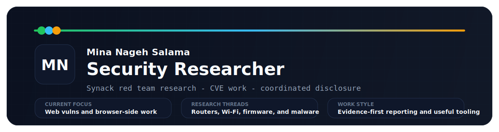

<h1 align="center">Mina Nageh Salama</h1>

  

  Security researcher and junior security engineer focused on web vulnerability research,
  browser-side investigations, malware analysis, and practical automation.

  
  <!--METRICS_BADGES_START-->
  
  
<!--METRICS_BADGES_END-->
  
  

<!--SIGNAL_START-->
## Operational Snapshot

> Auto-refreshed daily via GitHub Actions. Last refresh: 2026-03-29 15:51 UTC

<table>
  <tr>
    <td width="33%">
      <strong>Current role</strong> 
      Red Team Researcher at Synack
    </td>
    <td width="33%">
      <strong>Independent research</strong> 
      Since December 2020
    </td>
    <td width="33%">
      <strong>Current study</strong> 
      MSc at University of Tuscia (UNITUS), Italy
    </td>
  </tr>
</table>

  
  
  

<strong>CVE record:</strong> 2 public CVEs and 3 assigned 2026 CVE IDs currently awaiting public reference URLs.

<!--SIGNAL_END-->

## What I Work On

- Web vulnerability research with clear reproduction steps, impact framing, and remediation notes
- Browser-extension analysis, request/response inspection, and exploit-path validation
- Router, Wi-Fi, and firmware security work
- Python and JavaScript tooling to speed up testing, validation, and reporting
- Write-ups and investigations that preserve technical detail without turning into noise

## Selected Security Work

### Public CVEs

- [`CVE-2021-35036`](https://nvd.nist.gov/vuln/detail/CVE-2021-35036): Zyxel super-admin password leak affecting multiple router models
- [`CVE-2021-21735`](https://nvd.nist.gov/vuln/detail/CVE-2021-21735): ZTE H168N authentication bypass
- Account takeover on OLX Middle East via password-reset logic abuse
- Race condition in Medium's voting flow that enabled count manipulation
- [`ShotBird`](https://monxresearch-sec.github.io/shotbird-extension-malware-report/) analysis in March 2026: ownership-transfer to browser-based C2 chain, credential and form-data capture, and follow-on Windows credential targeting.
- Hack The Box work focused on systematic enumeration, common web vulnerabilities, and Linux privilege escalation

### Assigned 2026 CVE IDs

_Assigned by MITRE in March 2026. Public reference URLs are still being prepared._

- `CVE-2026-34472`: ZXHN H188A V6.0 unauthenticated credential disclosure via the web wizard, leading to admin, WLAN, and PPPoE credential exposure and auth bypass
- `CVE-2026-34473`: ZXHN H-series multiple models unauthenticated denial of service via oversized `application/x-www-form-urlencoded` POST bodies against the management interface
- `CVE-2026-34474`: ZXHN H298A and H108N sensitive data exposure through the web interface, leading to admin and WLAN credential disclosure

## Selected Public Projects

| Project | Why it matters |
| --- | --- |
| [Youtube-Downloader-Bookmarklet](https://github.com/minanagehsalalma/Youtube-Downloader-Bookmarklet) | Strongest public repo by stars; a JavaScript bookmarklet with real usage traction. |
| [huawei-dg8045-hg630-hg633-Config-file-decryption-and-password-decode](https://github.com/minanagehsalalma/huawei-dg8045-hg630-hg633-Config-file-decryption-and-password-decode) | Router-focused work that matches the security and firmware side of the profile. |
| [burpsuite-custom-extension](https://github.com/minanagehsalalma/burpsuite-custom-extension) | Current Python Burp extension work for response modification and testing workflows. |
| [BookMarkletsWiki](https://github.com/minanagehsalalma/BookMarkletsWiki) | Practical browser tooling collected into one place. |
| [Ubicast-Video-Downloader](https://github.com/minanagehsalalma/Ubicast-Video-Downloader) | Small targeted JavaScript tooling with a clear one-click use case. |
| [WIFI-Location-Locator-GUI](https://github.com/minanagehsalalma/WIFI-Location-Locator-GUI) | Public Wi-Fi utility work that aligns with the network side of the profile. |

## Experience And Education

- Red Team Researcher, Synack, Inc. | Remote | June 2025 to present
- Independent Security Researcher | Bug bounty and crowdsourced platforms | December 2020 to present
- MSc, University of Tuscia (UNITUS), Italy | 2025 to expected July 2027
- BSc Computer Science, Thebes Academy, Cairo | October 2021 to May 2025

## Toolbox

  
  
  
  

